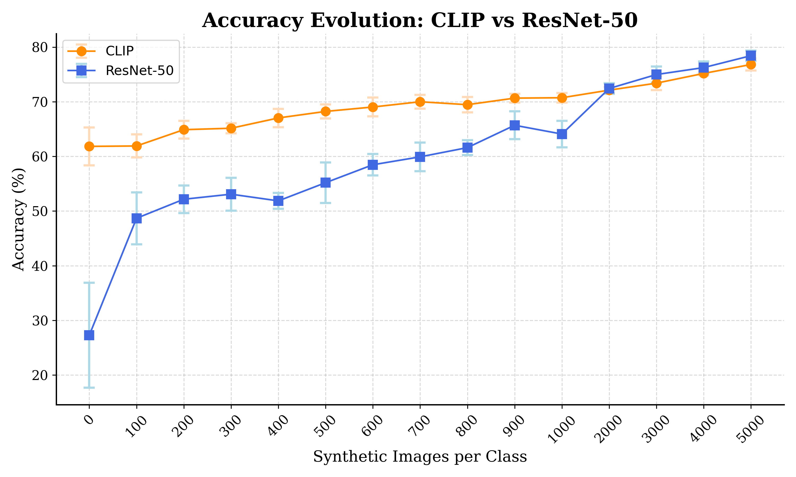

# CytoDiff – AI-Driven Cytomorphology Image Synthesis for Medical Diagnostics

This repository contains the full codebase developed at Helmholtz Munich for the CytoDiff project. The goal is to improve white blood cell image classification by augmenting real-world datasets with high-quality synthetic images generated via diffusion models fine-tuned using LoRA.

---

## 📄 Abstract

Biomedical datasets are often constrained by stringent privacy requirements and frequently suffer from severe class imbalance. These two aspects hinder the development of accurate machine learning models. While generative AI offers a promising solution, producing synthetic images of sufficient quality for training robust classifiers remains challenging. 

This work addresses the classification of individual white blood cells, a critical task in diagnosing hematological malignancies such as acute myeloid leukemia (AML). We introduce CytoDiff, a stable diffusion model fine-tuned with LoRA weights and guided by few-shot samples that generates high-fidelity synthetic white blood cell images. 

Our approach demonstrates substantial improvements in classifier performance when training data is limited. Using a small, highly imbalanced real dataset, the addition of 5,000 synthetic images per class improved ResNet classifier accuracy from 27% to 78% (+51%). Similarly, CLIP-based classification accuracy increased from 62% to 77% (+15%). These results establish synthetic image generation as a valuable tool for biomedical machine learning, enhancing data coverage and facilitating secure data sharing while preserving patient privacy.


---

## 🧪 Example: Synthetic White Blood Cell Images

Here are examples of synthetic white blood cell images generated by our pipeline:

<p align="center">
  
</p>

<p align="center">
  <em>Example images generated using a diffusion model fine-tuned on real few-shot samples.</em>
</p>

---

## 🔁 Pipeline Overview

The project follows a three-stage pipeline:

1. **LoRA Training**  
   Fine-tuning Stable Diffusion using class-specific samples.
2. **Image Generation**  
   Producing synthetic cell images using the trained diffusion model.
3. **Image Classification**  
   Evaluating the impact of synthetic data on downstream classification tasks.

Each stage must be completed sequentially.

---

## ⚙️ Setup

Install all required dependencies listed in the `requirements/` directory. It is highly recommended to use a virtual environment (e.g., `venv` or `conda`).

```bash
pip install -r requirements/requirements.txt
```

---


## 📊 Results: Accuracy Improvement

The plot below shows the improvement in classification accuracy when adding synthetic images generated by our diffusion model.

<p align="center">
  
</p>

---


## 📂 Repository Structure

```
CytoDiff/
├── classification/          # Classifier training and evaluation
├── generation/              # Synthetic image generation
├── training/                # LoRA fine-tuning for Stable Diffusion
├── datasets/                # Dataset storage
│   └── custom_wbc/          # Custom white blood cell dataset
│       ├── images/          # Cell images organized by class
│       │   ├── basophil/
│       │   ├── blast/
│       │   ├── eosinophil/
│       │   ├── lymphocyte/
│       │   ├── lymphocyte_variant/
│       │   ├── metamyelocyte/
│       │   ├── monocyte/
│       │   ├── myelocyte/
│       │   ├── neutrophil_band/
│       │   ├── neutrophil_segmented/
│       │   ├── plasma/
│       │   ├── prolymphocyte/
│       │   └── promyelocyte/
│       └── metadata/        # Dataset configuration and labels
│           ├── class_labels.txt      # Label for each image
│           ├── class_names.txt       # List of all class names
│           ├── dataset_config.yaml   # Dataset configuration
│           └── image_ids.txt         # Image identifiers
├── requirements/            # Python dependencies
└── experiments/             # Training and generation outputs
```

---

## 📁 Dataset Structure: `custom_wbc`

The `custom_wbc` dataset contains white blood cell images organized by cell type. Each class folder contains PNG images of individual cells.

**Dataset Overview:**
- **13 cell classes** representing different white blood cell types
- Images are stored in class-specific subdirectories
- Metadata files provide class mappings and configuration

**Class Descriptions:**
- `basophil` (BA) - Basophils
- `blast` (BL) - Blast cells
- `eosinophil` (EO) - Eosinophils
- `lymphocyte` (LY) - Lymphocytes
- `lymphocyte_variant` (LYV) - Variant lymphocytes
- `metamyelocyte` (MMY) - Metamyelocytes
- `monocyte` (MO) - Monocytes
- `myelocyte` (MY) - Myelocytes
- `neutrophil_band` (BNE) - Band neutrophils
- `neutrophil_segmented` (SNE) - Segmented neutrophils
- `plasma` (PC) - Plasma cells
- `prolymphocyte` (PLY) - Prolymphocytes
- `promyelocyte` (PMY) - Promyelocytes

**Image Naming Convention:**
Images follow the pattern: `{CLASS_ABBREVIATION}_{ID}.png` (e.g., `BA_005.png` for basophil)

---


## 📚 Citation

If you use this code or data, please cite our paper:

```bibtex
@inproceedings{boada2025cytodiff,
  title={CytoDiff: AI-Driven Cytomorphology Image Synthesis for Medical Diagnostics},
  author={Boada, Jan Carreras and Umer, Rao Muhammad and Marr, Carsten},
  booktitle={Proceedings of the IEEE/CVF International Conference on Computer Vision},
  pages={1125--1133},
  year={2025}
}
```

---
## 📜 License

This repository is intended for academic and research purposes only.  
If you have any questions or need further information, feel free to contact me at **jancarreras24@gmail.com**.

---


## Code Acknowledgement

This project uses code and resources adapted from the [DataDream repository](https://github.com/ExplainableML/DataDream).  
We thank the authors for making their work publicly available and for their valuable contributions to the field.

