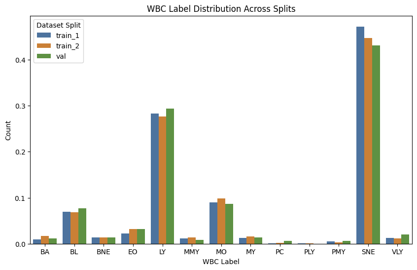
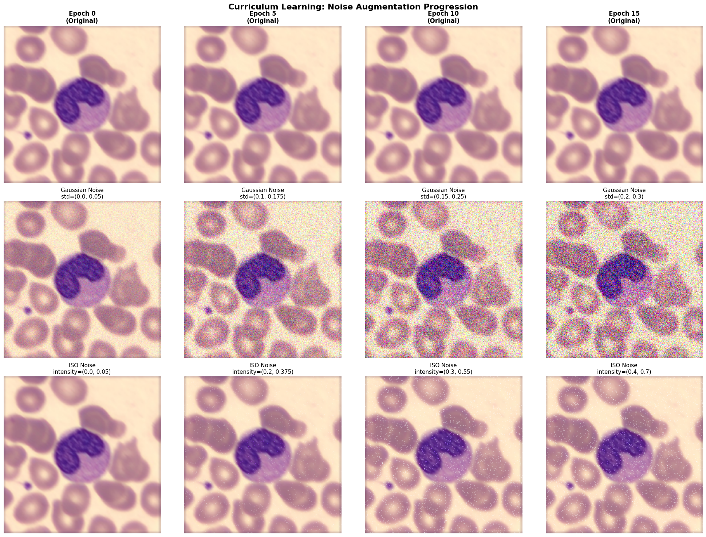

# WBCBench2026 Classification Challenge

Single-cell blood smear image classification across 13 white blood cell types. Achieved **3rd place** on the leaderboard with **~0.70 macro F1** using an ensemble approach.

## Challenge Overview

The dataset presents a severe class imbalance problem:



## Approach Evolution

### Failed Attempt: DinoBloom Foundation Model

Initially experimented with **DinoBloom**, a foundation model pre-trained on pathology blood smear and bone marrow slides. Despite extensive fine-tuning, classification performance plateaued at **0.33 macro F1**. UMAP visualization of CLS tokens revealed the fundamental issue: features were largely inseparable.


### Successful Solution: Ensemble with Curriculum Learning

Switched to a conventional deep learning approach with three key innovations:

#### 1. Extensive Augmentations
- H&E staining variations
- Color jitter
- Random affine transformations
- Geometric augmentations

#### 2. Curriculum Learning for Noise Robustness
Validation set analysis revealed edge cases with intensive noise (Gaussian, salt-and-pepper). Implemented curriculum learning to gradually introduce noise and blur during training, preventing the models from being overwhelmed early on.



#### 3. Three-Model Ensemble
- **Swin Transformer**
- **ConvNeXt v2**
- **ResNet-50**

All models initialized with pre-trained weights and trained using class-weighted sampling.

#### 4. Test-Time Augmentation
Applied geometric augmentations during inference. Probability aggregation across models and augmentations proved most effective.

## Results

- **Final Score**: ~0.70 macro F1 on test set
- **Leaderboard Rank**: 3rd place
- **Key Finding**: Curriculum learning for noise adaptation was critical for handling challenging edge cases

## Alternative Approach: Synthetic Data Generation (CytoDiff)

Given the severe class imbalance—with the rarest class having only **13 images**—learning generalizable features proved challenging. We explored a parallel generative approach using **CytoDiff**, a Stable Diffusion-based model fine-tuned with LoRA on the challenge dataset.

**Key Results from Synthetic Data Augmentation (from the original paper):**
- ResNet accuracy: **27% → 78%** (+51%) with 5,000 synthetic images per class
- CLIP-based accuracy: **62% → 77%** (+15%)

While synthetic data generation showed promise for addressing extreme imbalance, the ensemble approach with curriculum learning ultimately delivered superior performance on the challenge test set.

📁 Full implementation and analysis: [`CytoDiff/`](CytoDiff/)

## Repository Structure

```
├── ConvNeXt_v2.py          # ConvNeXt v2 implementation
├── SwinTransformer.py      # Swin Transformer implementation
├── ResNet50.py             # ResNet-50 implementation
├── ensemble_predict.py     # Ensemble prediction script
├── figures/                # Visualizations and analysis
└── requirements.txt        # Dependencies
```

## Dependencies

```bash
pip install -r requirements.txt
```